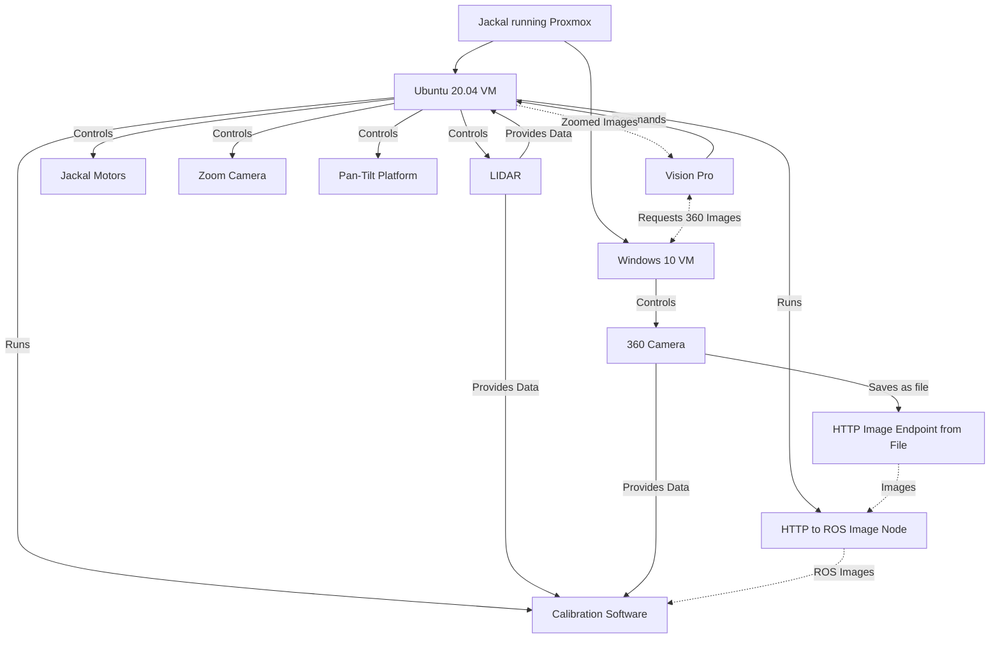

```mermaid
graph TD
    A[Jackal running Proxmox] --> B[Ubuntu 20.04 VM]
    A --> C[Windows 10 VM]
    
    B --> |Controls| D[LIDAR]
    D --> |Provides Data| B
    B --> |Controls| E[Jackal Motors]
    B --> |Controls| F[Zoom Camera]
    B --> |Controls| G[Pan-Tilt Platform]
    B --> |Runs| H[Calibration Software]
    D --> |Provides Data| H
    B --> |Runs| I[HTTP to ROS Image Node]
    
    C --> |Controls| J[360 Camera]
    J --> |Provides Data| H
    J --> |Saves as file| K[HTTP Image Endpoint from File]

    L[Vision Pro] --> |Commands| B
    L <-.-> |Requests 360 Images| C
    B -.-> |Zoomed Images| L
    
    K -.-> |Images| I
    I -.-> |ROS Images| H
```